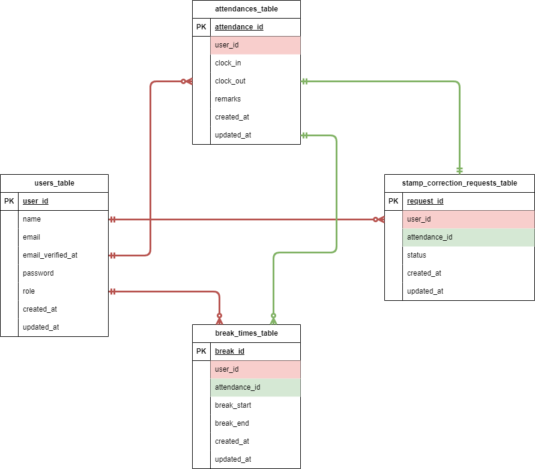

# coachtech-time-attendance-manegement-app（coachtech 勤怠管理アプリ）

## 環境構築

**Docker ビルド**

1. `git clone git@github.com:risamatsumoto1104/coachtech-time-attendance-manegement-app.git`
2. DockerDesktop アプリを立ち上げる
3. `docker-compose up -d --build`

**Laravel 環境構築**

1. PHP コンテナ内にログイン  
   `docker-compose exec php bash`
2. パッケージをインストールします。

```bash
composer install
```

3. 「.env.example」ファイルをコピーして「.env」ファイルを作成します。

```bash
cp .env.example .env
```

4. .env に以下の環境変数を変更。

```text
DB_CONNECTION=mysql
DB_HOST=mysql
DB_PORT=3306
DB_DATABASE=laravel_db
DB_USERNAME=laravel_user
DB_PASSWORD=laravel_pass

MAIL_MAILER=smtp
MAIL_HOST=mailhog
MAIL_PORT=1025
MAIL_USERNAME=null
MAIL_PASSWORD=null
MAIL_ENCRYPTION=null
MAIL_FROM_ADDRESS=test@example.com
MAIL_FROM_NAME="${APP_NAME}"
```

5. 本番環境（.env）と、テスト環境（.env.testing）の APP_KEY= を削除。  
   新たなアプリケーションキーを作成します。  
   キャッシュの削除も行ってください。

```bash
php artisan key:generate
php artisan key:generate --env=testing
php artisan config:clear
```

6. マイグレーションファイルと、ダミーデータの作成を行います。  
   初年度でのユーザー数 1000 人達成を目標としていますが、今回は 1 名（管理者）・10 名（一般ユーザー）で作成します。

```bash
php artisan migrate --seed
```

## テストアカウント

name: 管理者  
email: admin@example.com  
password: admin1234

---

name: 一般ユーザ  
email: それぞれの mail アドレス  
password: password

---

## ER 図



## 使用技術(実行環境)

- DockerCompose 3.8
- Laravel 8.x
- nginx 1.21.1
- PHP 8.2.8
- MySQL 8.0.26
- phpmyadmin
- mailhog

## メールを用いた認証テスト（MailHog を使用）

1. ユーザーの「新規登録」を行います。
2. 登録ボタンを押すと、メール認証コードが送信され、メール認証誘導画面に遷移します。
3. メール認証誘導画面のボタンをクリックして、MailHog にアクセス。メールを確認して下さい。
4. 「メール認証」ボタンを押下して、ブラウザにアクサスされる。  
   又は、phpMyAdmin にて登録したユーザーの email_verified_at に日付が記載されていれば成功です。

## PHPunit を用いたテスト

1. mysql コンテナ内にログイン  
   `docker exec -it コンテナID bash`

2．root ユーザーでログインして、テスト用データベースを作成します。  
 password: root

```bash
mysql -u root -p

CREATE DATABASE demo_test;
SHOW DATABASES;
```

3．php コンテナ内にログイン  
 `docker-compose exec php bash`

4．テスト用のマイグレーションファイルを作成をします。

```bash
php artisan migrate --env=testing
```

3. 以下のテストを行います。テストを実行してください。

- 認証機能（一般ユーザー）
- ログイン認証機能（一般ユーザー）
- 日時取得機能（一般ユーザー）
- ステータス確認機能（一般ユーザー）
- 出勤機能（一般ユーザー）
- 休憩機能（一般ユーザー）
- 退勤機能（一般ユーザー）
- 勤怠一覧情報取得機能（一般ユーザー）
- 勤怠詳細情報取得機能（一般ユーザー）
- 勤怠詳細情報修正機能（一般ユーザー）
- ログイン認証機能（管理者）
- 勤怠一覧情報取得機能（管理者）
- 勤怠詳細情報取得・修正機能（管理者）
- ユーザー情報取得機能（管理者）
- 勤怠情報修正機能（管理者）

```bash
vendor/bin/phpunit
```

## URL

- 開発環境：http://localhost/
- phpMyAdmin:：http://localhost:8080/
- MailHog：http://localhost:8025/
